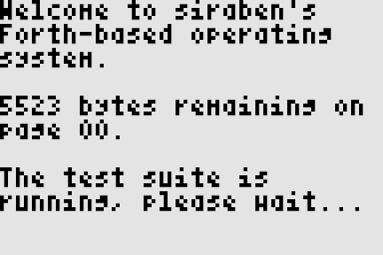

# zkeme80 - a Forth-based OS for the TI-84+ calculator
[](https://travis-ci.org/siraben/zkeme80)




**TLDR:** `assembler.scm` is the assembler, `zkeme80.scm` is the OS.
To build the rom, run `make build`.  There are no dependencies apart
from a recent version of Guile, supporting the modules `bytevectors`
and `sfri-9` records.  Other Scheme implementations have not been
tested.

## Why another OS for the TI-84+?
The TI tinkering community has long loathed the proprietary nature of
the default TI-OS.  Few projects have attempted to create a viable
alternative, fewer have matured to a usable state, and none are
currently able to actually let you use the calculator *as a
calculator*.

If you've been looking at operating systems for the TI-84+, chances
are you've come across **KnightOS**.  It's well developed and has
plenty of Unix-like features such as filesystems and tasks, and even a
C compiler.  But maybe that's not what you want.  You want an minimal
operating system that allows you to extend it in any way you wish,
bonus points if you don't need to know Z80 assembly to do so.

**zkeme80** is that operating system, a minimal core with a mostly
[ANS standard](https://forth-standard.org/standard/words) conforming
Forth interpreter/compiler.  From words covering sprites and graphics,
to text and memory access, everything you need to make the next hit
Snake clone or RPN-based math layer is already there.  **zkeme80**
lowers the barrier of entry for customizing an operating system and
enable rapid development cycles.  Below the Forth layer, you'll find
two lowest level and highest level languages, Z80 assembly and Scheme.
The best assembler is an extensible one, where writing macros should
be a joy, not a pain, and Scheme has that macro system.

On my MacBook Pro 11,1 running NixOS it takes around 13.5 seconds
(real time) to compile the operating system for the first time with
`make build`, and subsequent builds involving only changes to `.fs`
files take around 0.5 seconds (real time).

## Why Forth?
OS development is hard, doubly so if you're using assembly.  Keep
track of calling conventions, or which routines preserve which
registers is a tedious and error-prone task.  Nested loops and
`switch` statements are out of the window.  And most importantly, it
isn't easy to allow the user to extend the operating system.  Forth
changes that.  It's just as low level as assembly, but it can be as
high level as you want.  Want exceptions?  They're already there!
Want garbage collection and memory safety?  Roll your own!  See
`forth.scm` for more than 200 examples of Forth words.  If you're not
familiar with Forth, I highly recommend *Starting Forth* by Leo
Brodie.  Get it [here](https://www.forth.com/starting-forth/).

### Notes on standard-compliance
Some words are not standard.  This is because I copied them from my
other [Forth/Z80 project](https://github.com/siraben/ti84-forth),
which itself is based on jonesforth.  However, I did consult the ANS
standard to incorporate some of their good ideas.  For instance, the
test suite currently found in `bootstrap-flash4.fs` is only a very
slight (sans the floating point stuff) adaptation of the [offical test
suite](www.forth200x.org/tests/ttester.fs).  The current version of
the operating system runs a series of tests to check the correctness
of the word environment.  As time goes on I may consider making more
words standard-conforming.

### Did you write all of this?
Most of the assembly code outside of `forth.scm` was taken from
[SmileyOS](https://www.ticalc.org/archives/files/fileinfo/442/44227.html),
which itself is based on an older version of the [KnightOS
Kernel](https://github.com/knightos/kernel).  I chose SmileyOS because
it was the most "minimal" needed to get nasty stuff such as
locking/unlocking flash, display routines, key routines etc. out of
the way.  Code here that doesn't exist in SmileyOS was taken from
public sources, including the current version of KnightOS.  The rest
of the operating system is of my own design.


## Building and running the operating system
### Using the Makefile
Running `make build` should make generate a file called `zkeme80.rom`
in the same directory.  Simply pass that file to an emulator such as
[jsTIfied](https://www.cemetech.net/projects/jstified/) (works in the
browser) and start playing around!

Running just `make` builds and runs the project, but assumes that you
have already properly built `tielm` and can run it with `tielm2` on
the shell, and have Guile installed.  Be warned, though, `tilem` is
tricky to build and you have to enable all sorts of flags and install
dependencies.  If anyone knows a good emulator for macOS, please let
me know.

### Using the Nix package manager
If you're using the Nix package manager, just clone the repository and
run the following to compile and build the assembler, operating
system, and emulator.  It will automatically run the ROM when done.
Props to `clever` on `#nixos` for figuring out how to build `tilem`.

```shell
nix-build . -A runit && ./result
```

## Files included
- `assembler.scm` assembles s-exp style assembly code into binary.  Simply
  run `(load "assembler.scm")` into your Scheme REPL and
  run`(assemble-prog sample-prog)` to see the binary data.  Run
  `(assemble-to-file sample-prog "out.bin")` to write a binary file.
- `zkeme80.scm` is the Forth-based operating system.  Load
  `zkeme80.scm` then run `(make-rom "zkeme80.rom")` to output binary
  to a file `zkeme80.rom`.

## Design of the assembler
The assembler's core uses pattern matching.  The program counter is
implemented as a mutable Scheme object `*pc*`.  Labels are kept in a
global alist `*labels*`.  To allow for the use of jumps that refer to
labels declared after it, we use multiple passes.  The assembler is
designed to be extensible from various levels; the source code of the
assembler, pass 1 and pass 2.  Each layer can be extended using the
full power of Scheme.

The extensible nature of the assembler means that users can add
whatever features they desire that were not built in already, for
instance, re-targeting the assembler or adding missing instructions.

### Structure of assembly programs
Assembly programs consist of a list of elements that are either
expressions or procedures.

### Pass 1
#### Handling expressions
Each expression of a program is passed to `assemble-expr` (which also
checks if they're well-formed).  `assemble-expr` returns a record
type that has the following fields (for a normal instruction):

| Record entry | Type      | Description                                       |
| :-:          | :-:       | :-:                                               |
| `length`     | `integer` | The length of the instruction, in bytes.          |
| `gen-instr`  | `lambda`  | Thunk that computes the actual instruction bytes. |

The use of converting expressions into record types like this allows
us to compute the length of the program (and resolve look ahead
labels).

#### Handling procedures
Procedures (Scheme objects that satisfy the predicate `procedure?`)
that are embedded in a program must be able to be run without any
arguments, and return either `()` or an instruction record.  This is
the main extension mechanism for the assembler.  For instance, in
`macros.scm` there is a procedure called `fill-until-end` which
creates a list of bytes so that the total binary is `#x100000` bytes
long.

### Pass 2
Once the program makes it through Pass 1, we perform code generation
and label resolution.  All instruction records are required to have a
`length` property that tells in advance how many bytes will be
generated from the thunk.  Consistency between this number and what
the thunk outputs is checked.  Each instruction record is also checked
that it generates only unsigned 8-bit integers.  The result is
flattened into a list of unsigned numbers, which can be manipulated as
the user wishes.

## Debugging
The debugging process is pretty simple.  One just has to write a valid
Z80 assembly program in my s-exp format and run it through a
disassembler then compare the output.  If you're feeling particularly
brave you may skip this step and try your program out on a Z80 chip.

## Assembler Limitations
There is currently no instruction encoding (like the `z80data.tab`
file) that the assembler accepts, so to add new instructions the
current workflow is to look at relevant portions of the Z80 data sheet
and write new cases in the pattern matcher.  Adding such an encoding
would allow the assembler to be retargeted.
