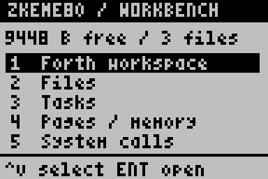
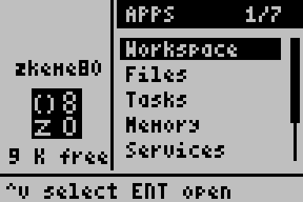

# Workbench walkthroughs

These are live LCD recordings from the headless
[TilEm fork](https://github.com/siraben/tilem-headless), enlarged four times
with nearest-neighbor sampling. Boot is trimmed; the remaining frames retain
their recorded order and timing. No UI elements or text are composited onto
the emulator output.


## Objects and the Forth workspace

Open Files, read two pages of the README, inspect and load a Forth source
object, and enter the workspace. `GREET` executes the definition loaded from
`SRC/GREET`; `BYE` returns to the desktop with the dictionary intact.



## Tasks, memory pages, and services

Create a cooperative demo task, pause and resume it, browse flash pages and
their hexadecimal contents, and page through the callable service catalog.



## Reproduce

The recorder creates a disposable ROM for each walkthrough and seeds three
named objects from [workbench-demo.fs](../tests/workbench-demo.fs). The
production ROM and its storage are never modified. The recording explicitly
loads `SRC/GREET` with ENTER from its preview; viewing source does not execute it.

Build the ROM, then run the recorder using a TilEm build that supports
`--headless`, `--macro`, and `--headless-record`:

```sh
nix develop -c make build
nix develop -c python3 tests/record-workbench.py \
  --emulator "$HOME/Git/tilem-headless/result/bin/tilem2" \
  --display :100 \
  --output /tmp/zkeme80-ui-demos
```

An X display must be available, even for the fork's headless mode. If needed,
start one in a separate terminal with
`nix develop -c Xvfb :100 -screen 0 1024x768x24 -nolisten tcp`.
The standard Nix development shell supplies Python and ImageMagick; its
stock TilEm package does not supply the headless recording extensions.
Raw macro key commands include an explicit 0.3-second released interval after
each press so repeated keys produce separate input events. TilEm's `key_delay`
setting only spaces characters in `scanstring` and `type` commands.

The recorder checks RAM snapshots to confirm fixture initialization,
object pagination, source loading, actual execution of `GREET`, resumed
task progress, no progress during a separate paused interval, and page/service
navigation. Injection follows the resident boot chain, so modules appended after
the workbench still initialize before the fixture runs. Original recordings, input
macros, screenshots, RAM snapshots, and timing/size metadata remain under
`--output`. By default, the scaled GIFs and cover image are written to
`docs/`; use `--assets` to choose another destination.
