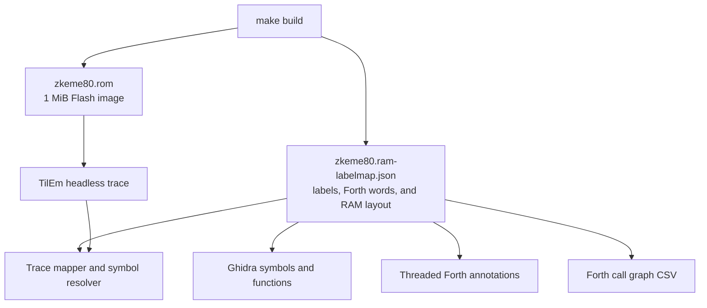

# zkeme80 reverse-engineering tools

This directory maps assembler-emitted symbols and Forth metadata into Ghidra
and dynamic TilEm traces. The label map gives native words and kernel routines
exact image offsets; runtime traces cover words compiled into RAM.

## Data flow



## Address spaces

The tools use two coordinate systems:

- *Image offset* — a byte position in `zkeme80.rom` and the JSON label map.
  Flash page $n$ occupies offsets $[n \times 0x4000, (n+1) \times 0x4000)$.
- *CPU address* — the address visible to the Z80. Flash page `00` is fixed at
  `00:0000`–`00:3FFF`; selected pages occupy `0x4000`–`0x7FFF`.

The image slice at offsets `0x8000`–`0xBFFF` describes the assembly-time RAM
layout. `src/boot.scm` clears runtime addresses `0x8000`–`0xFFFF`; it does not
copy that slice. The label map marks this slice as RAM so its symbols resolve at
their intended CPU addresses. [confirmed]

Native Forth words from `defcode` and `defword` in `src/forth.scm` reside on
Flash page `00`, where image offsets equal CPU addresses. Words compiled from
`.fs` sources reside in RAM and require a runtime trace. The static label map
still names their backing variables; the TilEm trace tool can reconstruct
runtime dictionary transitions with `--forth-rom`.

## Ghidra usage

The Java sources implement the GhidraScript interface used by Ghidra 12.
Adjust `GHIDRA` for the local installation, then run:

```sh
GHIDRA=/path/to/ghidra/support/analyzeHeadless
mkdir -p /tmp/zk80-proj
$GHIDRA /tmp/zk80-proj zkeme80 \
  -import src/zkeme80.rom \
  -processor z80:LE:16:default \
  -scriptPath re/ghidra \
  -postScript Zkeme80ApplyLabelmap.java src/zkeme80.ram-labelmap.json \
  -postScript Zkeme80AnnotateForth.java src/zkeme80.ram-labelmap.json \
  -postScript Zkeme80ForthCallgraph.java \
    src/zkeme80.ram-labelmap.json /tmp/callgraph.csv
```

`Zkeme80ApplyLabelmap.java` names assembler labels, prefixes RAM symbols with
`ram_`, creates functions, and disassembles at code labels.
`Zkeme80AnnotateForth.java` follows each `CALL docol` thread and adds word
sequences, per-cell comments, and data references.
`Zkeme80ForthCallgraph.java` assigns each page-`00` instruction before the
embedded source to its nearest routine and emits escaped `caller,callee` CSV
edges for calls and threaded cells. [confirmed]

The `swap-sector` equate has value `0x0038`, which is also the IM 1 vector.
Call-graph summaries should exclude `RST 0x38` edges attributed to that equate.

## Dynamic tracing

Dynamic tracing requires the
[tilem-headless](https://github.com/siraben/tilem-headless) fork. Build that
repository with `nix build .#tilem`, then capture and analyze a trace:

```sh
TILEM=~/Git/tilem-headless/result/bin/tilem2
$TILEM --headless --rom src/zkeme80.rom --model ti84p --normal-speed \
  --reset --macro re/macros/run-test-suite.macro \
  --trace /tmp/zk80.trace --trace-range all
python3 re/analyze_forth_trace.py /tmp/zk80.trace \
  src/zkeme80.ram-labelmap.json --forth-only --forth-bigrams --top 30
```

The analyzer memory-maps the trace, replays writes to mapper ports
`0x04`–`0x07`, handles mode-1 even/odd pairing, and reports instruction counts
by kernel label and page-`00` Forth word. It resolves `ram:8000`–`ram:BFFF`
when selector `0x81` maps that physical RAM page. Use a full trace: a ring
trace can discard mapper writes without recording their resulting state.
[confirmed]

`--forth-bigrams` counts adjacent entries at exact static Forth code-field
addresses. Dynamic adjacency can cross a colon-word call or return, so verify a
superinstruction candidate against adjacent threaded cells before fusing it.

Run the mapper, resolver, and profiler regression tests with:

```sh
python3 re/test_analyze_forth_trace.py -v
```

The fork's `tools/tilem_trace.py` reconstructs runtime dictionaries and RAM,
emits key-event timelines, and checks the cached-TOS Forth stack model.

## Test-suite macro

`re/macros/boot-only.macro` captures the boot screen.
`re/macros/run-test-suite.macro` opens the suite, waits for the terminal
`265/265` tally, sends the unload key, and captures the restored menu. The suite
unloads through `FORGET TEST-SUITE-START`.

`KEY` discards held input before waiting for a new key. Input sent while the
suite is running, or held before its final `PAUSE`, is therefore ignored. The
macro's 35-second normal-speed wait keeps the final **ENTER** press on the
unload prompt rather than in the active suite.
